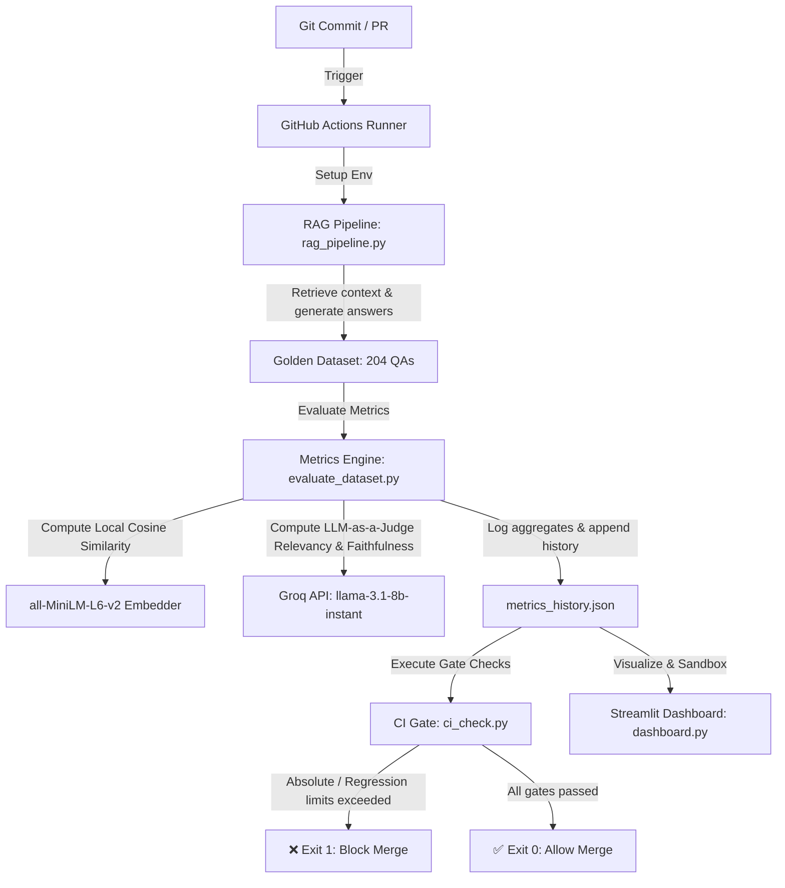

# Production-Grade LLM Evaluation CI/CD Pipeline 🧪

[](https://github.com/YOUR_USERNAME/llm-eval-pipeline/actions)

An automated RAG evaluation framework that acts like unit tests for AI. Every time a prompt changes, a RAG chunk is updated, or tax rules are modified, this pipeline runs a 204-question test suite, evaluates semantic quality, monitors hallucination rates and costs, and blocks merges if regression is detected.

---

## 🎯 Why This Project Exists

In standard software, we write unit tests because code behaves deterministically. In RAG (Retrieval-Augmented Generation) systems, it is incredibly easy to break quality silently:
- Upgrading a retriever chunking strategy might introduce noisy context.
- Adjusting a system prompt might cause the LLM to begin hallucinating details.
- Changing a model parameter might double response latency or API costs.

This project solves the "black box" problem by treating LLM evaluation as an automated CI/CD gate. It benchmarks a **204-question golden dataset** covering the complex, edge-case-heavy domain of **Indian Income Tax (Sections 80C, 80D, HRA, TDS)** to ensure no PR gets merged if quality decays.

---

## 🏗️ Architecture & Workflow



---

## 📊 Evaluation Metrics Matrix

Instead of naive string matching, this engine uses a multi-layered evaluation framework:

| Metric | Mechanism | Purpose | Why It Matters |
| :--- | :--- | :--- | :--- |
| **Semantic Relevancy** | Cosine Similarity of local SentenceTransformer (`all-MiniLM-L6-v2`) embeddings + LLM-as-a-Judge grading | Evaluates if the generated answer covers the meaning of the ground truth. | Word-overlap (Jaccard) fails if the LLM paraphrases or uses synonyms. |
| **Faithfulness** | LLM-as-a-Judge checking if every claim is grounded *only* in retrieved context | Directly detects hallucinations or external info leaks. | Traditional NLP metrics (ROUGE, BLEU) cannot measure factuality. |
| **SLA Latency** | `p50` (median) and `p95` percentile tracking | Monitors response times of the slowest 5% of queries. | Average latency hides spikes. `p95` is critical for production SLAs. |
| **Query Cost** | Input/Output token tracking via Groq usage API | Calculates actual API spend per query and per run. | Prevents prompt bloating or verbose model choices from exceeding budgets. |

---

## 🇮🇳 The Benchmark Domain: Indian Income Tax

To prove this evaluation framework under real-world complexity, the RAG knowledge base covers **Indian Income Tax Rules (FY 2024-25 / AY 2025-26)**:
- **Exemptions & slabs**: Metro vs. non-metro HRA calculations, Old vs. New tax regime slab exemptions, and age-based basic exemption limits.
- **Sections 80C & 80D**: Limits, lock-ins (PPF vs. ELSS), qualifying expenses (tuition fee exclusions), senior citizen medical allowances.
- **TDS Thresholds**: Salary (Sec 192), FD interest (Sec 194A), Rent (Sec 194I / 194IB), Professional Fees (Sec 194J), and Form 15G/15H rules.

The **204-question golden dataset** consists of:
- `factual`: Direct rule lookup (e.g. "What is the max 80C deduction?").
- `reasoning`: Multi-clause tax scenarios (e.g. "I earn 12 LPA, have 1.5L in 80C, which regime should I choose?").
- `edge_case`: Nuanced tax scenarios (e.g. "I pay rent to my mother, can I claim HRA?").
- `out_of_scope`: Off-topic queries to test correct LLM refusals (e.g. "What is GST on electronics?").

---

## ⚡ CI/CD Quality Gate & Regression Control

The [ci_check.py](ci_check.py) script acts as the automated gatekeeper. It runs on every pull request and validates:
1. **Absolute Thresholds**:
   - Pass Rate $\ge 70.0\%$
   - Hallucination Rate $\le 5.0\%$ (Faithfulness $\ge 95.0\%$)
   - p95 Latency $\le 3.5\text{ seconds}$
2. **Regression Check (Comparison vs. Previous Run)**:
   - Blocks merge if the pass rate regresses by $> 5.0\%$.
   - Blocks merge if average hallucination increases by $> 2.0\%$.
   - Blocks merge if p95 latency slows down by $> 15\%$.
   - Blocks merge if average cost per query increases by $> 20\%$.

---

## 🎛️ Streamlit Dashboard & Sandbox Playground

Launch the dashboard to monitor system health:
```powershell
python -m streamlit run dashboard.py
```

It features three modules:
1. **Run History & Trends**: Historical tracking of pass rates, semantic quality, and latencies over time read directly from the git-tracked `metrics_history.json`.
2. **Run Comparison Matrix**: Select any baseline run (A) and candidate run (B) to see a comparative metric dashboard and a diff list of regressions (passing cases that now fail) or improvements.
3. **Prompt Sandbox Playground**: Edit system prompts, modify parameters (temperature, top-k chunks), execute custom queries live against the vector store, and view real-time token counts, costs, and LLM-judge feedback.

---

## ⚙️ Quick Start

### 1. Prerequisites
- Python 3.11+
- Groq API Key (added to your `.env` file as `GROQ_API_KEY`)

### 2. Setup
```powershell
# Clone the repository
git clone https://github.com/YOUR_USERNAME/llm-eval-pipeline.git
cd llm-eval-pipeline

# Create and activate virtual environment
python -m venv venv
.\venv\Scripts\activate

# Install dependencies
pip install -r requirements.txt
```

### 3. Run Pipeline
```powershell
# Run the evaluation suite on the 204 questions
python evaluate_dataset.py

# Run the quality gate check
python ci_check.py
```
